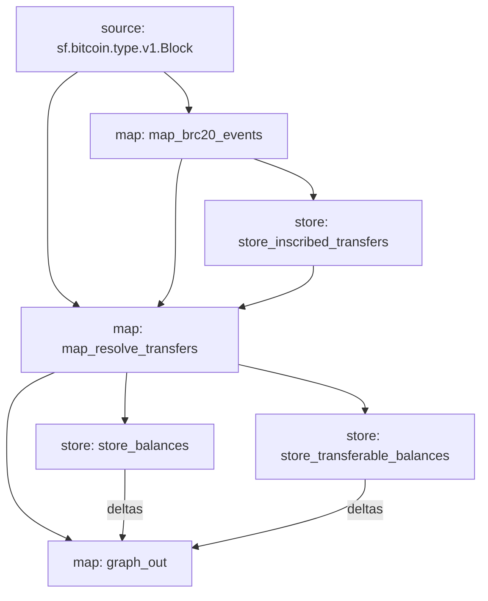

# BRC-20 Substreams
Substream for the BRC-20 [protocol](https://layer1.gitbook.io/layer1-foundation/protocols/brc-20) that tracks BRC-20 tokens, operations and account balances.

## Background
BRC-20 is a protocol that leverages Bitcoin Ordinals and Inscriptions to bring ERC-20 like tokens to the Bitcoin blockchain. The protocol uses inscriptions to record token operations (e.g.: minting and transfers) onchain. Each operation is represented by a JSON inscription.

It is important to understand that the rules of the protocol are not enforced onchain. Rather, a certain level of interpretation is required to correctly track BRC-20 tokens and balances. For instance, unlike smart contract protocols like ERC-20, nothing prevents a user from creating a `transfer` inscription for tokens they do not own.

The BRC-20 protocol defines three operations:
- `deploy`: Operation used to deploy a new BRC-20 token. Analogous to deploying an ERC-20 token contract on EVM compatible blockchains.
- `mint`: Operation used to create new units of a specific token.
- `transfer`: Operation used to transfer a certain quantity of tokens to another address.

Unlike the `deploy` and `mint` operations which only require a single Bitcoin transaction to execute, the `transfer` operation is actually performed in two steps. First, the token holder who wants to perform the transfer inscribes a `transfer` operation on a sat which they own. Then, to complete the transfer, the token holder must send the inscribed sat to the address to which they which to transfer the BRC-20 tokens.

More information about each operation, including the required fields for each operation can be found [here](https://layer1.gitbook.io/layer1-foundation/protocols/brc-20/documentation#operations).

## Implementation

The substream roughly follows the following procedure to extract and interpret BRC-20 operations:
1. Extraction (`map_brc20_events`, `store_inscribed_transfers`): Scan the block for inscriptions and extract those matching one of the three BRC-20 operations. Inscribed transfers are stored with the location of the inscribed sat (i.e.: UTXO and offset) so that it is possible to detect when the transfers are executed.
2. Balance updates (`map_resolve_transfers`, `store_balances`, `store_transferable_balances`): Mints, inscribed transfers and executed transfers are used to update holders' balances, as well as their transferable balances (i.e.: the quantity of tokens in transfers that have net yet been executed).
3. Subgraph sink (`graph_out`): Format all entity creations and changes to `EntityChanges` so that they can be handled by a `graph-node`.

### Limitations
Since the substream is not keeping track of ordinals nor the amount of sats held by each UTXO, this creates certain limitations. For instance, it is not possible to know the exact ordinal that has been inscribed with a BRC-20 operation. Moreover, in the case of transfer execution (i.e.: transfering the sat that has been inscribed with a `transfer` inscription), only transfers for which the inscribed sat is located in the first input UTXO of a transaction can be reliably handled.

For this first version of the substream, a lot of BRC-20 indexing "rules" are not enforced by the substreams (e.g.: transfer of tokens that the account does not own). This is partly due to the limitations of substreams store modules, which prohibit reading from and writing to a store in the same substreams module. This functionality would be necessary, for instance, to validate `mint` operations as we need to verify that the token can still be minted (i.e.: `total_minted + mint_amount < total_supply`) **and** update the token's `total_minted` value in the same module.

The list of indexing rules can be found [here](https://layer1.gitbook.io/layer1-foundation/protocols/brc-20/indexing).

For a checklist of indexing rules covered by this subtreams, see [checklist.md](checklist.md). 

## License
[Apache 2.0](LICENSE)
